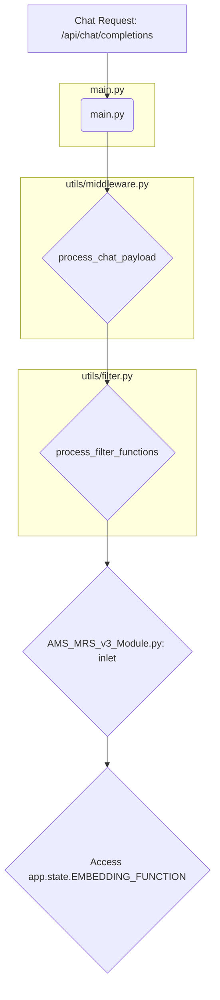

# Investigation Summary: Accessing the Upstream Embedding Model

This document outlines the findings of an investigation into whether the `AMS_MRS_v3_Module.py` filter module can use the embedding model configured in the Open WebUI "Settings > Documents" page, rather than its own hardcoded `SentenceTransformer`.

### Conclusion

Yes, it is entirely possible. The `AMS_MRS_v3_Module.py` can and should be modified to use the globally managed embedding function from the Open WebUI application state. This will align the module with the user's configuration, whether it's a local model, an Ollama endpoint, or an OpenAI API.

### How it Works: The Execution Flow

The ability to access the shared embedding model stems from the way Open WebUI processes chat requests through its middleware and filter pipeline.



1.  **Initialization (`main.py`):** When Open WebUI starts, it calls `get_embedding_function` and stores the resulting function in a globally accessible location: `app.state.EMBEDDING_FUNCTION`. This object is a singleton that represents the currently configured embedding model (e.g., a local SentenceTransformer, an Ollama API function, etc.).

2.  **Middleware (`utils/middleware.py`):** When a chat request is received, the `process_chat_payload` function is called. This function is the entry point for all `inlet` filters.

3.  **State Injection:** `process_chat_payload` creates an `extra_params` dictionary that contains the FastAPI `request` object. This is the key step, as the `request` object provides access to the application's state via `request.app.state`.

4.  **Filter Execution (`utils/filter.py`):** The `extra_params` dictionary is passed down through the filter processing logic. When the `inlet` method of the `AMS_MRS_v3_Module.py` is called, it receives these parameters in its `**kwargs`.

### Recommended Implementation

The `AMS_MRS_v3_Module.py` should be modified as follows:

1.  **Remove Hardcoded Initialization:** Delete the lines that initialize `SentenceTransformer` and `self.embedding_model` within the `Filter` class's `__init__` method.

2.  **Access the Shared Function:** In any method that needs to generate embeddings, access the shared embedding function from the `kwargs` passed to the `inlet` or `outlet` methods. Since the `inlet`/`outlet` are the entry points, you will need to pass the `request` object or the `embedding_function` itself down to the methods that need it.

   A simple approach is to store the function on `self` when it's first available.

   **Example Modification in `AMS_MRS_v3_Module.py`:**

   ```python
   class Filter:
       def __init__(self) -> None:
           self.embedding_model = None
           self.request = None
   
       async def inlet(self, body: Dict[str, Any], **kwargs) -> Dict[str, Any]:
           self.request = kwargs.get("__request__")
           if self.request:
               self.embedding_model = self.request.app.state.EMBEDDING_FUNCTION
   
       async def _get_candidate_memories_vector_search(self, user_id: str, query_text: str, top_k: int) -> List[str]:
           if not all([self.vector_db_client, self.embedding_model]):
               return []
           
           query_embedding = self.embedding_model(query_text).tolist()
   ```

By making this change, the memory module will seamlessly use whichever embedding model is configured in the main Open WebUI settings, making it more integrated and respecting the user's configuration choices.